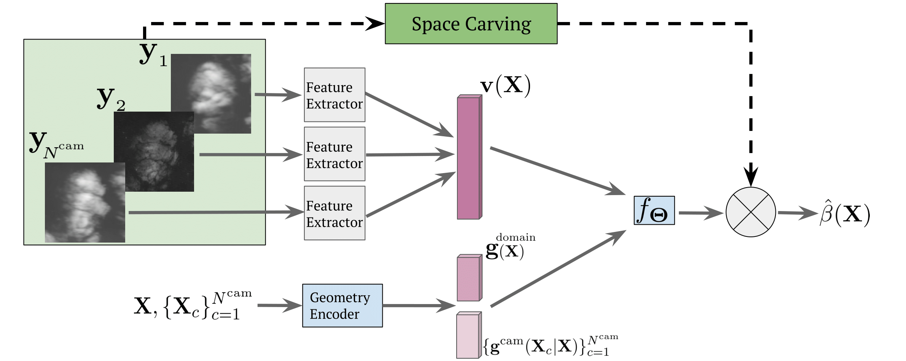
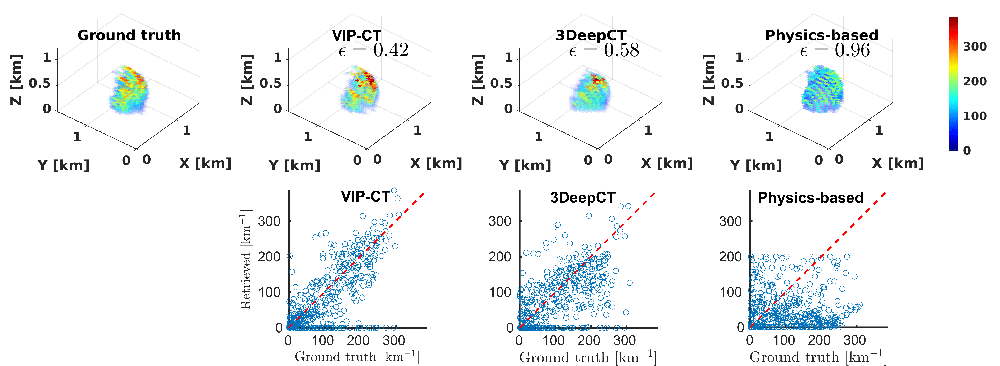

# VIP-CT: Variable Imaging Projection Cloud Scattering Tomography
[](https://ieeexplore.ieee.org/abstract/document/9847357)

## Abstract
Scattering-based computed tomography (CT) recovers a heterogeneous volumetric scattering medium using images taken
from multiple directions. It is a nonlinear problem. Prior art mainly approached it by explicit physics-based optimization of image-fitting,
being slow and difficult to scale. Scale is particularly important when the objects constitute large cloud fields, where volumetric
recovery is important for climate studies. Besides speed, imaging and recovery need to be flexible, to efficiently handle variable viewing
geometries and resolutions. These can be caused by perturbation in camera poses, or fusion of data from different types of
observational sensors. There is a need for fast variable imaging projection scattering tomography of clouds (VIP-CT). We develop a
learning-based solution, using a deep-neural network (DNN) which trains on a large physics-based labeled volumetric dataset. The
DNN parameters are oblivious to the domain scale, hence the DNN can work with arbitrarily large domains. VIP-CT offers much better
quality than the state of the art. The inference speed and flexibility of VIP-CT make it effectively real-time in the context of spaceborne
observations. The paper is the first to demonstrate CT of a real cloud using empirical data directly in a DNN. VIP-CT may offer a model
for a learning-based solution to nonlinear CT problems in other scientific domains.



## Description
This repository contains the official implementation of Variable Imaging Projection Cloud Scattering Tomography, accepted for publication in IEEE Transactions on Pattern Analysis and Machine Intelligence, and presented at ICCP 2022.
Our framework preforms fast scattering tomography of clouds for variable viewing
geometries and resolutions. The core of VIP-CT is a decoder, which assigns each 3D
voxel location an estimated value of the sought cloud extinction. The decoder has two inputs. One is a vector of image
features, associated with this voxel.  The other is a set of vectors that express 3D geometry relating to the voxel
location and the set of viewpoints.  For more details see our [paper](https://ieeexplore.ieee.org/stamp/stamp.jsp?tp=&arnumber=9847357) and [supplementary material](https://ieeexplore.ieee.org/ielx7/34/4359286/9847357/supp1-3195920.pdf?arnumber=9847357).




&nbsp;


## Installation 
Installation using using anaconda package management

Start a clean virtual environment
```
conda create -n vipct python=3.8
source activate vipct
```

Install required packages
```
pip install -r requirements.txt
```


&nbsp;


## Usage

### Data
We used cloud field data that were generated by Eshkol Eytan. Download simulated clouad data and real-world AirMSPI files [here](https://technionmail-my.sharepoint.com/:f:/g/personal/roironen_campus_technion_ac_il/EqKyFij1vp9AktzBZ_9gHpgBzdLVnAUDPJz9Df_4X7UAXQ?e=KnkmtR).
&nbsp;


### Simulations
#### Training 
Set the config file at configs.vip-ct_train.yaml according to the desired experiment, e.g. dataset_name: 'CASS_10cams' / 'BOMEX_32cams' etc.
Then, run


```
python VIPCT/train_CT.py
```

#### Evaluation 
Set the config file at configs.vip-ct_test.yaml according to the desired experiment and trained model path.
Then, run

```
python VIPCT/test_CT.py
```
&nbsp;

### AirMSPI
#### Training 
Set the config file at configs.vip-ct_train_airmspi.yaml according to the desired experiment, e.g. drop_index: 2 etc.
Then, run


```
python VIPCT/train_CT_AirMSPI.py
```

#### Evaluation 
Set the config file at configs.AirMSPI_test_varying.yaml according to the desired experiment and trained model path. 
Then, run

```
python VIPCT/test_CT_AirMSPI.py
```

### Models
The VIP-CT trained models can be found [here](https://technionmail-my.sharepoint.com/:f:/g/personal/roironen_campus_technion_ac_il/ErkbzbuTr4NDnhrumeJDVLEBbAihvTYP5mwvkWUu_GuBLQ?e=QbEOXS).


&nbsp;


## Citation
If you make use of our work, please cite our paper:
```
@article{ronen2022variable,
  title={Variable Imaging Projection Cloud Scattering Tomography},
  author={Ronen, Roi and Holodovsky, Vadim and Schechner, Yoav Y},
  journal={IEEE Transactions on Pattern Analysis and Machine Intelligence},
  year={2022},
  publisher={IEEE}
}
```
Thanks to Eshkol Eytan for the cloud simulation data. If you use it please cite:
```
@article{eytan2021revisiting,
  title={Revisiting adiabatic fraction estimations in cumulus clouds: high-resolution simulations with a passive tracer},
  author={Eytan, Eshkol and Koren, Ilan and Altaratz, Orit and Pinsky, Mark and Khain, Alexander},
  journal={Atmospheric Chemistry and Physics},
  volume={21},
  number={21},
  pages={16203--16217},
  year={2021},
  publisher={Copernicus GmbH}
}
```

If you use this package in an academic publication please acknowledge the appropriate publications (see LICENSE file). 

